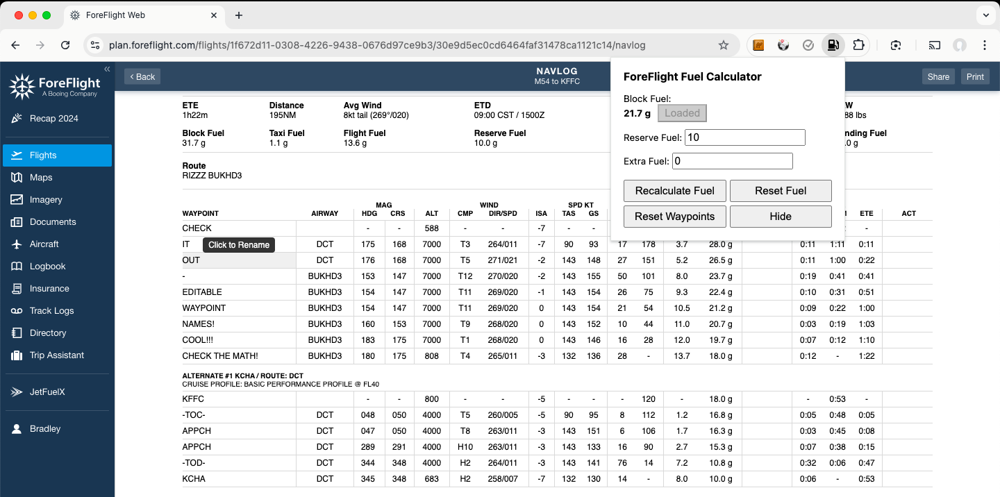

# FF Fuel Recalc

## Description
FF Fuel Recalc is a Chrome extension designed to help pilots using ForeFlight by recalculating fuel values and allowing for easy management of waypoint names directly within the application.

## Features
- **Recalculate Fuel**: Automatically updates fuel values based on user input for block fuel, reserve fuel, and extra fuel.
- **Editable Waypoints**: Users can click on waypoint names to rename them directly in the navlog.
- **Reset Functionality**: 
  - **Reset Fuel**: Resets the fuel values to the original block fuel.
  - **Reset Waypoints**: Restores waypoint names to their original values.
- **Tooltips**: Hovering over waypoint cells displays a tooltip saying "Click to Rename".

## Installation
1. Download the ZIP file containing the extension.
2. Unpack the ZIP file into your desired location.
3. Open Chrome and navigate to `chrome://extensions/`.
4. Enable "Developer mode" in the top right corner.
5. Click "Load unpacked" and select the directory containing the unpacked extension files.

## Usage
1. Navigate to a valid ForeFlight navlog URL.
2. Click on the extension icon to open the popup.
3. Load the block fuel values by clicking the "Load" button.
4. Edit waypoint names directly by clicking on them.
5. Use the "Recalculate Fuel" button to update fuel values based on the inputs.
6. Click "Reset Fuel" to revert to the original block fuel values.
7. Click "Reset Waypoints" to restore the original waypoint names.

## Disclaimer
**Important**: This extension is intended to assist with fuel calculations, but it is the user's responsibility to double-check all calculations. The developer of this extension is not liable for any inaccuracies or errors in the calculations. Users should ensure they have sufficient fuel for their flights and should not rely solely on this tool for critical flight planning.

## Files
- `manifest.json`: Configuration file for the Chrome extension.
- `background.js`: Background script that manages tab updates and URL checks.
- `content.js`: Content script that interacts with the ForeFlight page to manipulate fuel and waypoint data.
- `popup.js`: Script for the popup interface that handles user interactions.
- `popup.html`: HTML file for the popup interface.
- `style.css`: (if applicable) CSS file for styling the popup.

## Contributing
Feel free to submit issues or pull requests if you have suggestions for improvements or new features.

## License
This project is licensed under the GNU General Public License v3.0 (GPL-3.0).

## Screenshots

